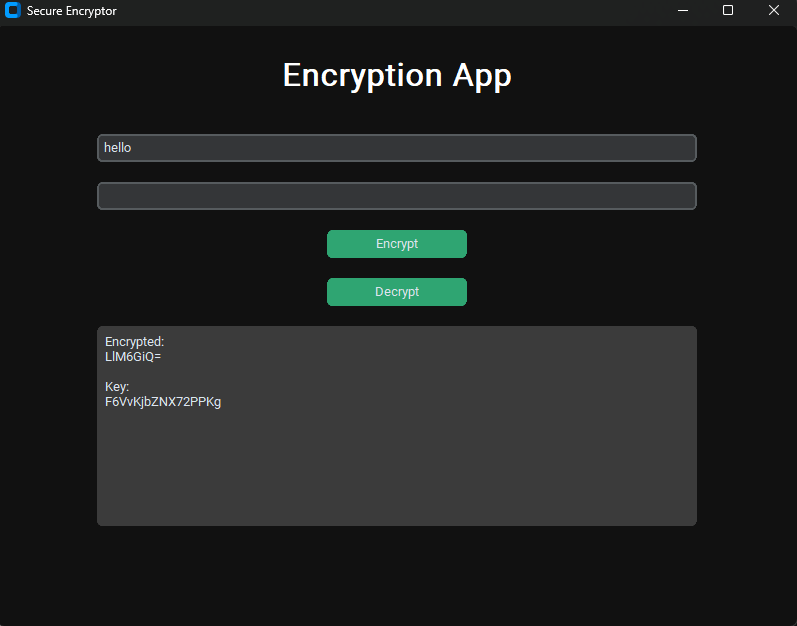
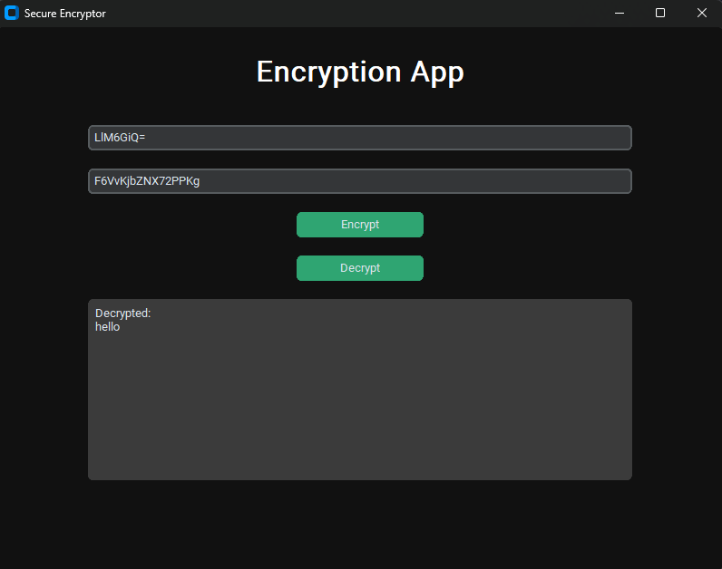

<h1 align="center" id="title">Secure_Encrpt</h1>

<p align="center"></p>

<p id="description">Aapp for securely encrypting and decrypting messages using XOR encryption with RSA key exchange.</p>

<h2>Project Screenshots:</h2>





  
  
<h2> Features</h2>

Here're some of the project's best features:

*   encryption
*   RSA
*   XOR
*   BIT WISE OPERATIONS

<h2> Installation Steps:</h2>

<p>1. git clone</p>

```
https://github.com/d3-f4u1t/Secure_Encrpt.git
```

<p>2. Run this command to install dependencies:</p>

```
pip install -r requirements.txt
```
