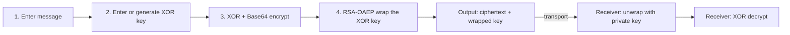
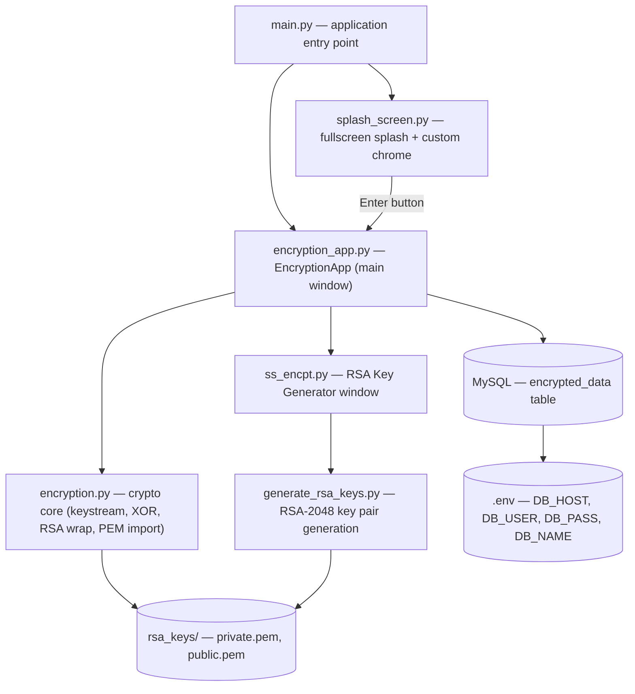
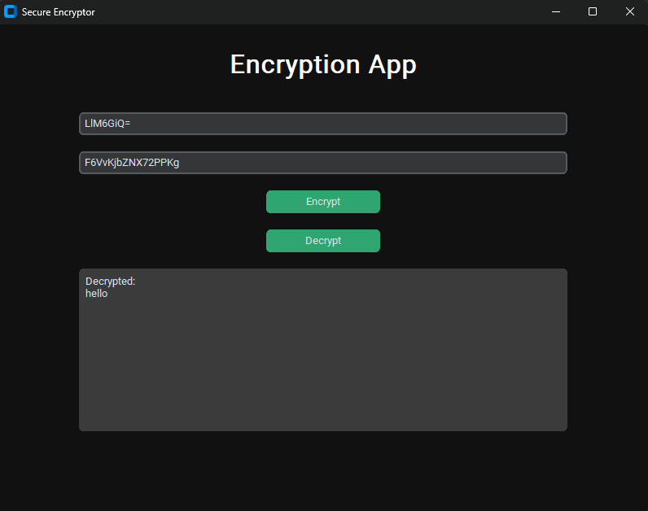

<h1 align="center" id="title">SECURE ENCRPT</h1>

<p align="center"></p>

# Secure Encrpt

> **A Desktop Hybrid Encryption Toolkit — XOR Stream Cipher for the Message, RSA-OAEP for the Key**

Secure Encrpt is a Python desktop application that encrypts and decrypts messages using a **hybrid scheme**: a fast XOR stream cipher protects the message body, and RSA-OAEP wraps the symmetric key so it can travel safely alongside the ciphertext.

The whole point of the project is to demonstrate, in a small and readable codebase, how **symmetric encryption** and **asymmetric key exchange** are combined correctly — the sender encrypts with a key only the receiver can unwrap, and never has to transmit that key in the clear.

**Author:** [D3FAU1T](https://discordapp.com/users/873571615852617760) · **License:** MIT · **Stack:** Python · CustomTkinter · `cryptography` · PyCryptodome · MySQL

---

## Table of Contents

1. [Core Concepts & Hybrid Architecture](#core-concepts--hybrid-architecture)
2. [The Problem: Why Plain XOR Is Not Encryption](#the-problem-why-plain-xor-is-not-encryption)
3. [Architectural Comparison](#architectural-comparison)
4. [Implementation Status](#implementation-status)
5. [Cryptographic Specification](#cryptographic-specification)
6. [The Encryption & Decryption Pipeline](#the-encryption--decryption-pipeline)
7. [System Architecture & Tech Stack](#system-architecture--tech-stack)
8. [Graphical Interface Reference](#graphical-interface-reference)
9. [Data Model](#data-model)
10. [Getting Started (Step-by-Step Setup)](#getting-started-step-by-step-setup)
11. [Configuration & Environment Variables](#configuration--environment-variables)
12. [Design Principles](#design-principles)
13. [Development Roadmap](#development-roadmap)
14. [Security & Privacy](#security--privacy)
15. [Repository Structure](#repository-structure)
16. [Contributing](#contributing)
17. [License](#license)

---

## Core Concepts & Hybrid Architecture

Conventional "encryption" demos stop at a single primitive. Secure Encrpt is built around the observation that **no single primitive does the whole job well**, so the design splits the problem into two layers that are each individually appropriate.

1. **Symmetric Layer — XOR Stream Cipher**: The message is XORed against a deterministic keystream derived from a short, memorable key. This is fast, key-agnostic, and handles arbitrary message length. Bare XOR is broken by key periodicity, so the keystream is instead generated by a **SHA-256 counter-mode KDF**, which removes the repeating-key weakness entirely.
2. **Asymmetric Layer — RSA-OAEP Key Exchange**: The short XOR key is far too valuable to send in the clear. It is wrapped with the **receiver's RSA-2048 public key** using OAEP padding with SHA-256, producing a 256-byte blob that can be published anywhere.
3. **Key Material Separation**: The private key never leaves the receiver's machine. The sender only ever needs a public key, which is safe to distribute.
4. **Portable Payloads**: Both the ciphertext and the wrapped key are Base64-encoded, so they survive being pasted into a text box, an email, or a chat message.
5. **Auditable Ciphertext**: The key is displayed alongside the ciphertext, so an operator can always verify a round-trip by hand.

```text
SIDE A (Sender)                                  SIDE B (Receiver)
──────────────────────────────────────────       ──────────────────────────────────────────
1. choose / generate XOR key                    1. holds rsa_keys/private.pem
2. ciphertext = B64( M ⊕ KS(key) )              2. unwrapped_key = RSA-OAEP⁻¹( wrapped )
   where KS = SHA256(key ‖ ctr)‖ SHA256(key‖ctr+1)…
                                                 3. message = B64⁻¹( ciphertext ) ⊕ KS(key)
   wrapped   = RSA-OAEP( public.pem, key )
        │
        └──▶  ship ( ciphertext , wrapped )  ────▶
```

---

## The Problem: Why Plain XOR Is Not Encryption

The textbook "encrypt with a repeating key" example is the first thing every cryptography student writes, and the first thing every cryptography teacher asks them to delete. It fails in four specific ways — and each of those four failures is directly addressed by a design decision in this project.

```text
[ NAIVE REPEATING-KEY XOR ]
Keystream:  key repeated cyclically ("abcdabcdabcd...")
Key size:   32 bits, unchanged per message
Padding:    none, so length is leaked
Recovery:   known-plaintext (Kasiski / index of coincidence)
```

### The Failure Modes
1. **Key Periodicity**: A repeated key leaks its own length. A ciphertext of `abababab` immediately tells you the key is `ab`, because XOR of identical plaintext with identical key bytes cancels to zero.
2. **Short Keyspace**: A 4-byte repeating key has only 2³² possibilities. Any ciphertext of moderate length can be brute-forced or attacked with a crib-dragging search in seconds.
3. **No Authentication**: Plain XOR output is malleable. Flipping one ciphertext bit flips the matching plaintext bit, and nothing detects the tampering.
4. **Key Transmission Problem**: Even a perfect symmetric cipher fails if the key has to be sent over the same channel as the message.

### How Secure Encrpt Answers Them

| Failure | Response in this project |
| :--- | :--- |
| Key periodicity | Keystream is **SHA-256(key ‖ counter)** chained in 32-byte blocks and truncated to the message length — no cycle, no periodicity, and it scales past the key length. |
| Short keyspace | User-supplied keys are expanded through a cryptographic hash, so effective key material is not bounded by key *length*. |
| No authentication | Not yet addressed. RSA-OAEP provides integrity for the wrapped key, but the XOR layer itself is unauthenticated. See [Roadmap](#development-roadmap). |
| Key transmission | The XOR key is **never transmitted** — it is RSA-encrypted to the receiver's public key and unwrapped locally with the private key. |

> **Honest framing:** this project is a teaching implementation of hybrid encryption, not a production messaging system. The threat model is "someone is reading the channel," not "someone is a cryptanalyst with your CPU."

---

## Architectural Comparison

| Dimension | Naive XOR | Pure RSA | Secure Encrpt |
| :--- | :--- | :--- | :--- |
| **Primitive** | Repeating-key XOR | RSA-OAEP only | **XOR stream + RSA-OAEP** |
| **Message Size Limit** | Unlimited | ~190 bytes (2048-bit key) | **Unlimited** |
| **Key Length on the Wire** | Full key length | n/a | **256 bytes (one RSA block)** |
| **Speed** | Very fast | Slow for bulk data | **Fast bulk, one slow op** |
| **Receiver Needs Secret** | The XOR key | The private key | **Private key only** — the XOR key is derived, not shared |
| **Key Reuse Across Messages** | Catastrophic | Safe | **Unsafe by design** — no IV (see below) |
| **Integrity of Payload** | None | OAEP-protected | **Key: yes · Message: no** |
| **Failure Mode** | Trivially broken | Oversized input | **Realistic hybrid operation** |

---

## Implementation Status

The repository contains working product code and a partially realized data layer. Every capability is labeled so a design goal is never mistaken for something that already ships.

| Capability | Status |
| :--- | :--- |
| Splash screen with custom window chrome (sidebar toggle, minimize, close) | Implemented |
| Main application window (CustomTkinter, dark + green theme) | Implemented |
| SHA-256 counter-mode keystream derivation | Implemented |
| XOR encrypt / decrypt with Base64 transport encoding | Implemented |
| ASCII round-trip verified (`encrypt → decrypt` returns the original) | Verified |
| RSA-2048 key pair generation (GUI window and standalone module) | Implemented |
| Public key import with PEM validation and safe copy into `rsa_keys/` | Implemented |
| RSA-OAEP (SHA-256 / MGF1-SHA256) encryption of the XOR key | Implemented |
| Automatic chaining: import public key → auto-wrap the XOR key | Implemented |
| Cryptographically secure random key generation (`secrets` module) | Not implemented — uses `random` |
| Random IV / nonce per message (prevents ciphertext reuse) | Not implemented |
| RSA unwrap of the XOR key (receiver side) | **Broken** — see [Known Gaps](#known-gaps-and-issues) |
| Unicode round-trip | **Lossy** — encrypt encodes UTF-8, decrypt decodes `latin-1` |
| MySQL persistence of ciphertext + keys | **Incomplete** — see [Known Gaps](#known-gaps-and-issues) |
| `.gitignore` / `.env.example` | **Missing** — `rsa_keys/private.pem` is committed |
| Automated test suite | Not implemented |
| Message authentication (HMAC / AEAD) | Not implemented |

### Known Gaps and Issues

Documented honestly rather than hidden, because each one is a real defect a user will hit:

- **Receiver-side RSA unwrap is unreachable.** The `decrypt_xor_key_rsa` helper is defined *inside* the body of `encrypt_xor_key_rsa` (`encryption.py:122`), so it never becomes a module-level symbol. The GUI's "Decrypt XOR Key with RSA" button then imports a name that does not exist (`from encryption import decrypt_xor_key`, `encryption_app.py:235`), which raises `ImportError` at click time.
- **Unicode does not survive the round trip.** `xor_encrypt` encodes with `utf-8` while `xor_decrypt` decodes with `latin-1`, so any message outside ASCII returns mojibake. Verified: `'héllo 🌍'` → `'héllo \ufffd\x9f\x8c\x8d'`.
- **Ciphertexts are deterministic.** Identical plaintext plus identical key produces identical ciphertext, because there is no IV. This is the standard "ECB-like" weakness of a keyed stream without a nonce.
- **`db.py` cannot execute as written.** `save_encryption` inserts into columns `message` / `rsa_encrypted_key`, but `create_table` creates `meaaage` / `rsa_encryted_key` (both misspelled). Neither `create_database()` nor `create_table()` is ever called — the calls in `main.py` are commented out. The `.env` path is also a hardcoded absolute path to the original author's machine.
- **Auto-generated keys use `random`, not `secrets`.** `generate_random_key` uses the Mersenne Twister, which is predictable and unsuitable for key material.

> The long-term system is the direction, not a claim that every row above already ships.

---

## Cryptographic Specification

### 1. Keystream Derivation (Counter-Mode KDF)

The user-supplied key is expanded into a deterministic byte stream of the required length. Each 32-byte block is a SHA-256 digest of the key bytes concatenated with a 64-bit big-endian counter, so the same key always produces the same stream and the stream never repeats within a message.

```text
KS(key, n) = SHA256(key ‖ 0x0000000000000000) ‖ SHA256(key ‖ 0x0000000000000001) ‖ … truncated to n bytes
```

```python
counter_bytes = counter.to_bytes(8, byteorder="big")
stream += hashlib.sha256(key_bytes + counter_bytes).digest()
```

**Why this matters:** a plain repeating key of length *k* produces a ciphertext with period *k*. A SHA-256 keystream has no period, so the classical attacks on repeating-key XOR (frequency analysis on short periods, Kasiski examination, index of coincidence) no longer apply.

### 2. Symmetric Encryption — XOR Stream Cipher

```text
ciphertext_b64 = B64( UTF8(message) ⊕ KS(key, ‖UTF8(message)‖) )
```

```python
plain_bytes = plain_text.encode("utf-8")
keystream   = gen_keystream(key, len(plain_bytes))
encrypted   = bytes(plain_bytes[i] ^ keystream[i] for i in range(len(plain_bytes)))
return base64.b64encode(encrypted).decode("utf-8")
```

Decryption is the identical operation in reverse: Base64-decode, regenerate the same keystream, XOR, and decode.

```text
message = LATIN1( B64⁻¹(ciphertext_b64) ⊕ KS(key, ‖B64⁻¹(ciphertext_b64)‖) )
```

Because `c ⊕ k ⊕ k = c`, encryption and decryption are the *same* function. The keystream length is derived from the ciphertext length, so any message length is supported.

### 3. Random Key Generation

```text
key = 16 characters drawn uniformly from [a-zA-Z0-9]
```

| Property | Value |
| :--- | :--- |
| Length | 16 characters (16 × 6 ≈ 95 bits of alphabet entropy) |
| Alphabet | `a-z A-Z 0-9` (62 symbols) |
| Source | `random.choice` — **Mersenne Twister, predictable** |
| Target | `secrets.choice` over `os.urandom` (not implemented) |

### 4. Asymmetric Key Exchange — RSA-OAEP

The XOR key is wrapped with the receiver's RSA-2048 public key using OAEP padding with SHA-256 for both the hash and the mask generation function.

```text
wrapped = RSA-OAEP(
    padding = OAEP(mgf = MGF1(SHA256), algorithm = SHA256, label = None),
    message = key.encode("utf-8"),
    key     = public.pem            # PEM, SubjectPublicKeyInfo
)
```

| Parameter | Value |
| :--- | :--- |
| Key size | 2048 bits |
| Public exponent | 65537 |
| Padding | OAEP (PKCS#1 v2) |
| Hash / MGF1 | SHA-256 |
| Ciphertext size | 256 bytes → 344 Base64 characters |
| Plaintext capacity | 256 − 2 × 32 − 2 = **190 bytes** per block |
| Private key format | PKCS#8, PEM, unencrypted |
| Public key format | SubjectPublicKeyInfo, PEM |

Private keys are written with `NoEncryption()`. There is no passphrase prompt, so the file on disk is the secret itself.

### 5. Public Key Import and Validation

```text
read bytes → load_pem_public_key(validate) → copy into rsa_keys/ → remember filename
```

A key that fails to parse raises `ValueError`, which the GUI surfaces as an error dialog rather than crashing. Only the *filename* is retained in memory, never the full path, so the lookup is always relative to the app's `rsa_keys/` directory.

### 6. Byte-Level Helpers

A set of binary conversion utilities is included for the bit-level view of the data. They are available for experimentation but are **not** on the encrypt/decrypt path.

| Function | Direction | Purpose |
| :--- | :--- | :--- |
| `text_to_binary(text)` | text → `'01000001…'` | 8-bit binary string per character |
| `binary_to_text(bits)` | `'01000001…'` → text | Inverse, 8 bits per character |
| `binary_to_base64(bits)` | bits → Base64 | Packs the bit string into bytes, then Base64 |
| `base64_to_binary(b64)` | Base64 → bits | Inverse of the above |
| `gen_keystream(key, n)` | key → bytes | The counter-mode KDF described above |

### 7. Complexity and Limits

```text
Keystream:   O(n) per message, 32 bytes of SHA-256 output per 32 bytes of plaintext
XOR:         O(n) per message
Base64:      O(n) per message
RSA wrap:    one fixed-cost 2048-bit public-key operation
Storage:     ~4/3 × message length (Base64) + 344 characters (wrapped key)
Max RSA payload: 190 bytes — the XOR key must stay under this
```

---

## The Encryption & Decryption Pipeline

The full sender workflow runs in four steps, and the app chains them automatically once a public key is present.


```mermaid
graph LR
    A["1. Enter message"] --> B["2. Enter or generate XOR key"]
    B --> C["3. XOR + Base64 encrypt"]
    C --> D["4. RSA-OAEP wrap the XOR key"]
    D --> E["Output: ciphertext + wrapped key"]
    E -->|"transport"| F["Receiver: unwrap with private key"]
    F --> G["Receiver: XOR decrypt"]
```

| Step | What Happens | Code Path |
| :--- | :--- | :--- |
| **1. Enter message** | Plaintext goes into the message field. | `EncryptionApp.message_entry` |
| **2. Choose key** | Key comes from the key field; if left blank, a 16-character key is generated. | `generate_random_key()` |
| **3. Encrypt** | Keystream is derived and XORed; result is Base64. | `encryption.py:xor_encrypt` |
| **4. Wrap key** | The XOR key is RSA-encrypted with the imported public key and Base64-encoded. | `encryption.py:encrypt_xor_key_rsa` |
| **5. Persist** | If MySQL is configured, the plaintext, XOR key, and wrapped key are recorded. | `db.py:save_encryption` |
| **6. Transport** | The operator ships the ciphertext and the wrapped key to the receiver out of band. | manual |
| **7. Unwrap** | The receiver selects their private key and recovers the XOR key. | *currently broken* |
| **8. Decrypt** | The receiver XORs the ciphertext with the recovered keystream. | `encryption.py:xor_decrypt` |

### Automatic Chaining

Importing a public key triggers `auto_encrypt_xor_key` immediately, so the normal flow is: import the receiver's `public.pem` → the app wraps the current XOR key and shows the Base64 blob, ready to send.

### Where the Design Would Go Next

The intended direction is a complete round trip in-app: select a private key → unwrap → auto-decrypt the ciphertext sitting in the message field. That path is blocked only by the missing module-level `decrypt_xor_key_rsa` described in [Known Gaps](#known-gaps-and-issues).

---

## System Architecture & Tech Stack


```mermaid
graph TD
    Entry["main.py — application entry point"]
    Splash["splash_screen.py — fullscreen splash + custom chrome"]
    App["encryption_app.py — EncryptionApp (main window)"]
    KeyGen["ss_encpt.py — RSA Key Generator window"]
    Core["encryption.py — crypto core (keystream, XOR, RSA wrap, PEM import)"]
    Keys["generate_rsa_keys.py — RSA-2048 key pair generation"]
    Store[("rsa_keys/ — private.pem, public.pem")]
    DB[("MySQL — encrypted_data table")]
    Env[(".env — DB_HOST, DB_USER, DB_PASS, DB_NAME")]

    Entry --> Splash
    Entry --> App
    Splash -->|"Enter button"| App
    App --> Core
    App --> KeyGen
    App --> DB
    KeyGen --> Keys
    Core --> Store
    Keys --> Store
    DB --> Env
```

### Core Technologies
- **Language**: Python 3 — developed and tested on 3.13
- **GUI Framework**: Tkinter, themed with **CustomTkinter** (dark appearance, green accent)
- **Cryptography (RSA)**: `cryptography` — key generation, PEM parsing/validation, OAEP encryption
- **Cryptography (RSA decrypt)**: `pycryptodome` — `RSA.import_key` + `PKCS1_OAEP` for the private-key path
- **Hashing**: `hashlib` (SHA-256) for the counter-mode keystream
- **Transport Encoding**: `base64` (standard library)
- **Persistence**: `mysql-connector-python` with credentials loaded by `python-dotenv`
- **Design Language**: Near-black surfaces (`#111111` / `#1E1E1E`) with green accent buttons, a fullscreen splash screen, and a custom titlebar with a slide-in sidebar

---

## Graphical Interface Reference

There is no HTTP surface — the entire interface is a desktop GUI.

### Splash Screen

| Element | Behaviour |
| :--- | :--- |
| Fullscreen launch | The window goes fullscreen 100 ms after creation, so the splash is uninterrupted. |
| Title block | "SECURE ENCRPT", the D3FAU1T credit, the tagline, and a Courier-font description. |
| `☰` toggle | Slides a 300 px sidebar in from the left, or back out. |
| Sidebar | Contains a "My Discord" button that opens the author's profile in the default browser. |
| Minimize / Close | Custom buttons in the top-right corner, since the native titlebar is hidden. |
| `Enter` | Destroys the splash window and opens the main application. |

### Main Application Window

| Control | Purpose |
| :--- | :--- |
| `Enter message` | Plaintext input, or the ciphertext when decrypting. |
| `Enter XOR Key` | The symmetric key. Left blank, a 16-character key is generated on encrypt. |
| `Encrypt` | XOR-encrypts the message and prints the ciphertext plus the key used. |
| `Decrypt` | Requires a key in the key field; reports back if none is present. |
| `Import Public Key` | Opens a `*.pem` file dialog, validates the key, copies it into `rsa_keys/`, then auto-wraps the current XOR key. |
| `Generate RSA Keys` | Opens the key generator window, which writes a fresh `private.pem` / `public.pem` pair. |
| `Decrypt XOR Key with RSA` | Selects a private key and unwraps the Base64 key blob from the message field. *Currently non-functional — see [Known Gaps](#known-gaps-and-issues).* |
| Output box | Scrollable result area; every action overwrites its contents. |

### Key Generator Window

A separate `Toplevel` window with a single action. Pressing **generate keys** creates a 2048-bit RSA key pair, writes both PEM files into `rsa_keys/`, and confirms with a success dialog.

<p align="center">
  
</p>

---

## Data Model

### Key Material on Disk

```text
rsa_keys/
├── private.pem        # PKCS#8 RSA-2048 private key, unencrypted  (SECRET)
├── public.pem         # SubjectPublicKeyInfo RSA-2048 public key
└── public_key.pem     # same format, used by the hardcoded fallback path
```

### MySQL Schema

```sql
CREATE TABLE IF NOT EXISTS encrypted_data (
    id               INT AUTO_INCREMENT PRIMARY KEY,
    meaaage          TEXT NOT NULL,   -- plaintext of the message
    xor_key          TEXT NOT NULL,   -- the symmetric key, stored in clear
    rsa_encryted_key TEXT NOT NULL,   -- the same key, RSA-wrapped for transport
    created_at       TIMESTAMP DEFAULT CURRENT_TIMESTAMP
);
```

> **Note:** the column names above are reproduced exactly as they appear in `db.py`. The misspelling is real, and the matching `INSERT` in `save_encryption` uses the corrected spellings — so the insert and the schema do not currently agree.

| Column | Contents | Sensitivity |
| :--- | :--- | :--- |
| `id` | Auto-increment surrogate key | None |
| `meaaage` | The original plaintext message | **Plaintext — sensitive** |
| `xor_key` | The symmetric key in clear | **Secret** |
| `rsa_encryted_key` | The symmetric key, RSA-OAEP wrapped and Base64-encoded | Wrapped |
| `created_at` | Insert timestamp, server default | None |

Values are bound as query parameters (`%s` placeholders) rather than string-interpolated, so message content cannot inject SQL. The only interpolated value is the database name in `CREATE DATABASE IF NOT EXISTS`, which comes from the local environment file.

---

## Getting Started (Step-by-Step Setup)

### System Prerequisites
- **Python**: 3.10 or newer (developed on 3.13)
- **OS**: Windows, macOS, or Linux with a display — this is a desktop GUI app
- **MySQL**: optional, only needed for the persistence path

---

### 1. Clone the Repository

```bash
git clone https://github.com/d3-f4u1t/Secure_Encrpt.git
cd Secure_Encrpt
```

### 2. Create and Activate a Virtual Environment
- **Linux / macOS:**
```bash
python3 -m venv venv
source venv/bin/activate
```
- **Windows (PowerShell):**
```powershell
python -m venv venv
.\venv\Scripts\Activate.ps1
```

### 3. Install Dependencies

```bash
pip install -r requirements.txt
```

| Package | Role |
| :--- | :--- |
| `customtkinter` | Themed widget layer over Tkinter |
| `cryptography` | RSA key generation, PEM handling, OAEP encryption |
| `pycryptodome` | RSA private-key import and OAEP decryption |
| `python-dotenv` | Loads DB credentials from a `.env` file |
| `mysql-connector-python` | MySQL driver for the persistence layer |

### 4. Run the Application

```bash
python main.py
```

The splash screen appears fullscreen. Press **Enter** to open the main window.

### 5. First-Time Workflow

1. Press **Generate RSA Keys** → a `private.pem` / `public.pem` pair lands in `rsa_keys/`. Keep `private.pem` for yourself; it is the whole secret.
2. Type a message, then a key (or leave the key blank to have one generated for you).
3. Press **Encrypt** → the output box shows the ciphertext and the key used.
4. Press **Import Public Key** and select the *receiver's* `public.pem` → the app immediately wraps your XOR key and shows the Base64 blob.

### 6. Optional: MySQL Persistence

Create a `.env` file next to the project and point `db.py` at it (see [Configuration](#configuration--environment-variables)), then call `create_database()` and `create_table()` once. The persistence path is currently **not** wired up — see [Known Gaps](#known-gaps-and-issues).

---

## Configuration & Environment Variables

Secrets live in a local `.env` file and must **never** be committed. The repository currently ships **no `.gitignore` and no `.env.example`**, so create both before you commit anything.

| Variable | Example | Description |
| :--- | :--- | :--- |
| `DB_HOST` | `localhost` | MySQL server hostname |
| `DB_USER` | `root` | MySQL username |
| `DB_PASS` | `your-password` | MySQL password |
| `DB_NAME` | `secure_encrpt` | Database created and used by the app |

`db.py` loads this file with an **absolute, machine-specific path** (`load_dotenv(r"C:\Users\hkpan\.ENV FILES/.env")`). Change it to a relative `.env` next to the project before running anywhere but the original machine.

> **Recommended `.gitignore` entries**
> ```text
> .env
> __pycache__/
> *.pyc
> rsa_keys/private.pem
> rsa_keys/public.pem
> rsa_keys/public_key.pem
> ```

---

## Design Principles

1. **Hybrid by Design**: Symmetric for the data, asymmetric for the key — each primitive used where it is actually strong.
2. **No Raw XOR**: XOR only ever touches a hash-derived keystream, never the bare user key.
3. **Offline First**: The GUI needs no network. RSA wraps a key locally; nothing is transmitted by the app.
4. **Private Keys Stay Local**: Only the public key is ever imported or distributed.
5. **Bytes, Not Strings**: Text is encoded to UTF-8 before encryption and everything on the wire is Base64.
6. **Readable Over Clever**: The codebase is seven small files with explicit names, intended to be read end to end.
7. **Honest Status**: Implemented, verified, and planned are labeled separately so the design is never confused with the build.

---

## Development Roadmap

### Phase 1: Correctness (current)
- Promote `decrypt_xor_key_rsa` to module scope and fix the GUI import so the receiver path works
- Align the `INSERT` column names with the `CREATE TABLE` schema and wire up `create_database` / `create_table`
- Replace `latin-1` decoding with `utf-8` so Unicode round-trips
- Remove the hardcoded absolute `.env` path; ship `.env.example` and `.gitignore`
- Stop committing `rsa_keys/private.pem`

### Phase 2: Cryptographic Hardening
- Generate XOR keys with `secrets` instead of `random`
- Add a random IV per message, prefixed to the ciphertext, so the keystream is never reused
- Authenticate the ciphertext with HMAC-SHA256, or migrate the symmetric layer to AES-GCM
- Add a passphrase prompt for private key generation so `private.pem` is not plaintext on disk
- Correct the UI hint that suggests matching key length to message length — the KDF makes that irrelevant

### Phase 3: Usability
- Paste ciphertext directly into the decrypt field and let the app auto-detect the operation
- Show the wrapped key and the ciphertext in separate labelled fields with copy buttons
- A history view for past encryptions, replacing the single overwritten output box
- Export and import a `.seenc` bundle containing ciphertext, wrapped key, and IV

### Phase 4: Engineering
- A pytest suite covering keystream determinism, round-trip across lengths and encodings, and RSA wrap/unwrap
- Replace the `latin-1`/`utf-8` split with a single explicit encoding policy
- Type hints and a `pyproject.toml`; drop the unused `from venv import create` in `db.py`
- SQLite fallback so the app runs without a MySQL server

---

## Security & Privacy

Encryption projects are only as trustworthy as their defaults, so the current state is stated plainly.

- **Key pair generation** uses `cryptography`'s CSPRNG at 2048 bits with exponent 65537.
- **The wrapped key** is protected by RSA-OAEP with SHA-256, which is malleability-resistant.
- **Credentials** are read from environment variables via `python-dotenv`, never hardcoded.
- **SQL statements** use bound parameters, so message content cannot inject SQL.

Things you should know before trusting this with anything real:

- **The message layer is unauthenticated.** There is no MAC and no AEAD. An attacker who can modify the ciphertext can flip chosen bits in your plaintext without detection. Use this for learning, not for messages that matter.
- **There is no IV.** The same message encrypted twice with the same key produces the same ciphertext, which leaks equality of plaintexts.
- **`rsa_keys/private.pem` is committed to this repository.** Treat that key as compromised and never use it. Generate a fresh pair before doing anything.
- **Keys are shown on screen and stored in clear.** The `Encrypt` action prints the XOR key next to the ciphertext, and `save_encryption` writes both the plaintext and the key to MySQL unencrypted. A screenshot or a database dump is a full compromise.
- **Auto-generated keys come from `random`**, which is not cryptographically secure.

Report vulnerabilities as described in [`SECURITY.md`](SECURITY.md).

---

## Repository Structure

```text
Secure_Encrpt/
├── main.py                  # Entry point: splash screen, then the main app
├── splash_screen.py         # Fullscreen splash, custom titlebar, slide-in sidebar
├── ss_encpt.py              # RSA Key Generator window (Toplevel)
├── encryption_app.py        # EncryptionApp — the main GUI and its button handlers
├── encryption.py            # Crypto core: keystream, XOR, RSA-OAEP wrap, PEM import
├── generate_rsa_keys.py     # RSA-2048 key pair generation into rsa_keys/
├── db.py                    # MySQL persistence layer and .env loading
├── rsa_keys/                # Key material (private.pem, public.pem, public_key.pem)
├── assets/                  # Screenshots used in this README
├── .github/ISSUE_TEMPLATE/  # Bug report and feature request templates
├── requirements.txt         # Python dependencies
├── req.txt                  # Original design notes and to-do list
├── CODE_OF_CONDUCT.md       # Community guidelines
├── CONTRIBUTING.md          # Contribution guide
├── SECURITY.md              # Security policy and disclosure contact
├── LICENSE                  # MIT
└── README.md                # This document
```

---

## Contributing

1. Create a feature branch:
```bash
git checkout -b feature/your-feature-name
```
2. Make your change. If you touch `encryption.py`, add a test that proves the round trip — there is currently no test suite, and the crypto core is exactly where one is needed.
3. **Never commit** `.env`, `__pycache__/`, or anything under `rsa_keys/`.
4. Commit using [Conventional Commits](https://www.conventionalcommits.org/) (`feat:`, `fix:`, `docs:`).
5. Push and open a Pull Request with a clear description, referencing related issues.

Bugs and feature requests go through [GitHub Issues](https://github.com/d3-f4u1t/Secure_Encrpt/issues) — the repository has templates for both.

---

## License

Released under the [MIT License](LICENSE). © 2025 Hardik Panwar.
